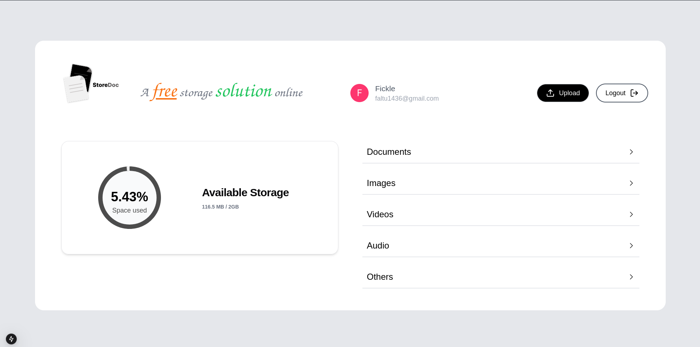
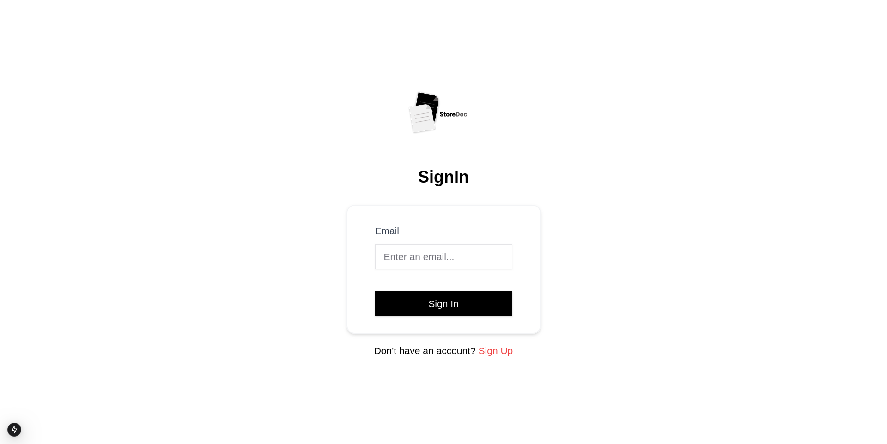
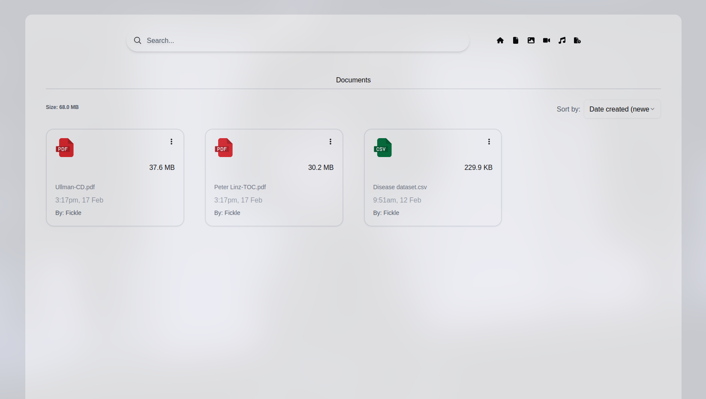
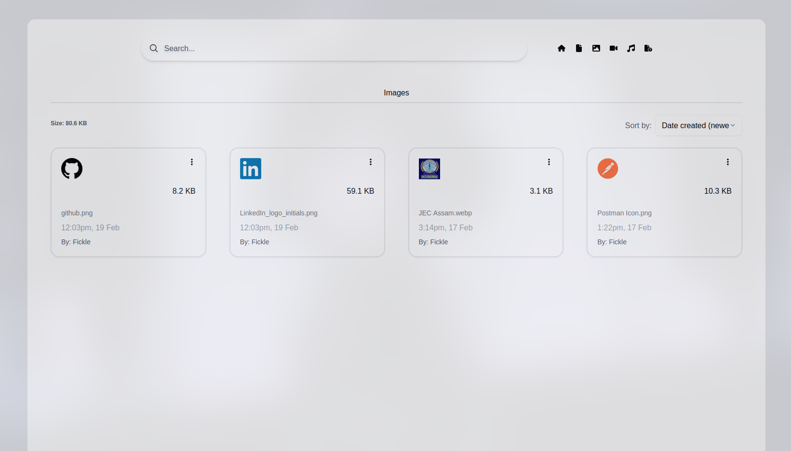
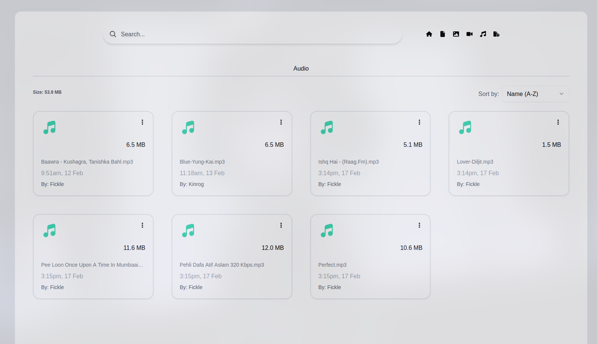
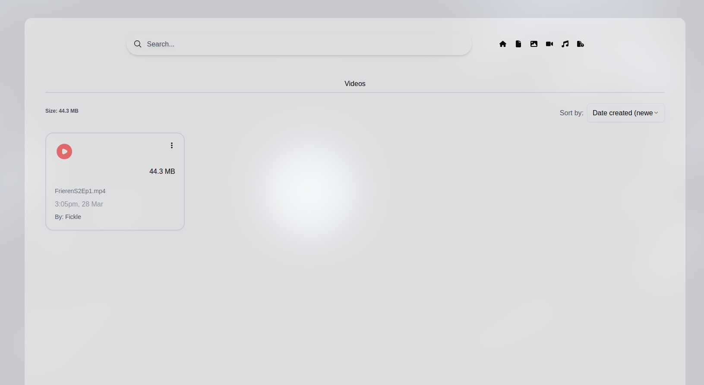
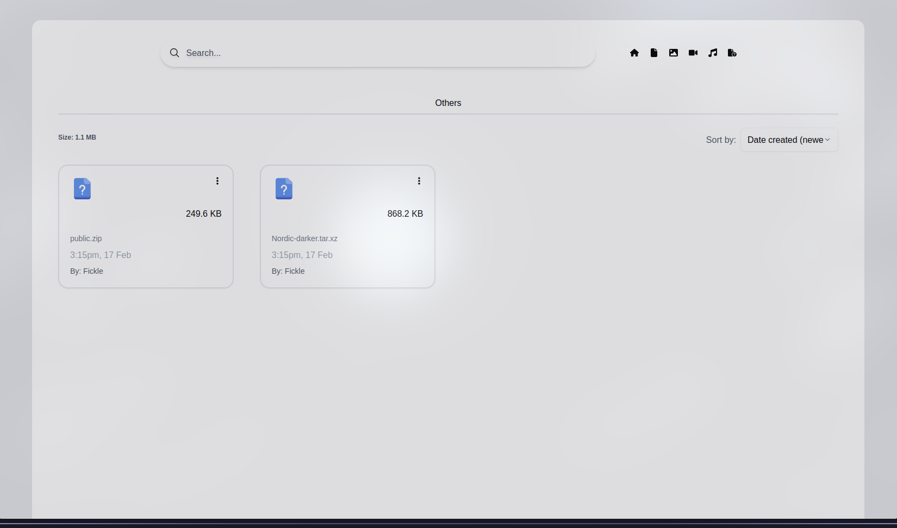

# storeDoc

storeDoc is a web application designed to facilitate the upload and storage of files on the web and local storage solutions.

Store Pdfs

Store Images

Store Audio

Store Videos

Store Anything

## Features

- **Access Control**: Set Access Control Lists (ACLs) to manage file permissions.
- **MIME Type Handling**: Automatically detect and assign the correct MIME type to uploaded files.

## Deployment

The application is deployed on Vercel and can be accessed at [store-doc-one.vercel.app](https://store-doc-one.vercel.app).

To deploy your own instance:

1. **Fork the repository** on GitHub.

2. **Connect your forked repository to Vercel** by following the [Vercel deployment documentation](https://nextjs.org/docs/deployment).

3. **Set up environment variables** on Vercel to configure your cloud storage credentials.

## License

This project is licensed under the MIT License. See the [LICENSE](LICENSE) file for details.

## Acknowledgements

- Built with [Next.js](https://nextjs.org/).
- Deployed on [Vercel](https://vercel.com/).
